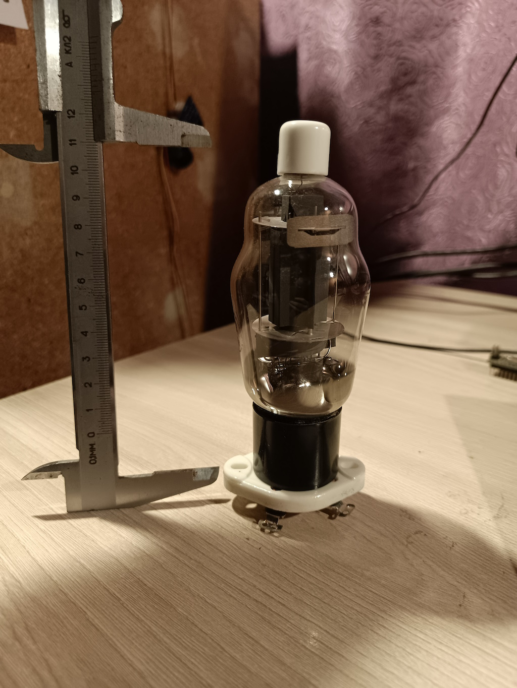

# Malysh Amplifiers

<div class="rom-hero">
    <h1 class="rom-hero-title">Malysh</h1>
    <p class="rom-hero-subtitle">Tube Amplifiers with Character</p>
</div>

---

## Specifications

| Parameter | Value |
|-----------|-------|
| **Circuit Type** | Push-Pull Class A/AB |
| **Output Tubes** | G-807 (2 pcs) |
| **Driver/Phase Inverter** | 6N23P-EV (2 pcs) |
| **Power** | 2×15W (into 4-8 Ohm load) |
| **Frequency Range** | 15 Hz – 40 kHz (±1 dB) |
| **THD** | < 1% at rated power |
| **Inputs** | RCA (stereo) |
| **Volume Control** | ALPS (motorized) |

---

## Signal Architecture

```
RCA Input → ALPS Pot → 6N23P-EV (driver) → 
Phase Inverter → G-807 (output stage) → TVZ → Speakers
```

### Stages

1. **Input Stage** — Motorized ALPS potentiometer
2. **Driver Stage** — 6N23P-EV, voltage gain
3. **Phase Inverter** — Split-load circuit
4. **Output Stage** — G-807 in push-pull configuration
5. **Transformers** — TVZ on OSM cores

---

## Operating Modes

| Mode | Idle Current | Class | Sound |
|------|--------------|-------|-------|
| **A** | 60 mA | Pure Class A | Soft, detailed |
| **AB** | 45 mA | Class AB | Dynamic, powerful |

Mode selected via tube controller or set fixed in PSU.

---

## Supported Tubes

Thanks to the universal platform and Tube controller, Malysh is capable of working with a wide range of output tubes:

### G-807 — Signature Tube of Malysh




| Tube | Equivalent | Sound Character |
|------|------------|-----------------|
| **G-807** | — | Charisma and power, signature Malysh sound |
| **6P3S** | 6L6 | Classic, warm bass |
| **EL34** | — | British rock, aggressive mids |
| **6P36S** | — | Low impedance, bass control |
| **6P44S** | — | Detailed highs, fast response |
| **GU-50** | — | Tank sound, maximum power |

---

## Measurement and Calibration

### Curve Tracer

Built-in system automatically captures tube characteristics:

- **Ia (anode current)** — vs voltage
- **Vg (grid voltage)** — bias curves
- **Emission** — residual cathode life

### Auto-Bias

Tube controller holds idle current with **0.1 mA** precision:

- Automatic adjustment during warmup
- Compensation for tube aging
- Degradation notifications

---

## Connections

```
[Source] → RCA → [Malysh] → Speakers
                    ↓
              USB/Ethernet → PC (Lisp agent)
```

### Interfaces

| Port | Purpose |
|------|---------|
| **RCA** | Stereo input (line level) |
| **USB** | Debug, firmware, curve tracing |
| **Ethernet** (production) | Network, remote monitoring |

---

[← Back to Malysh](index.md)
