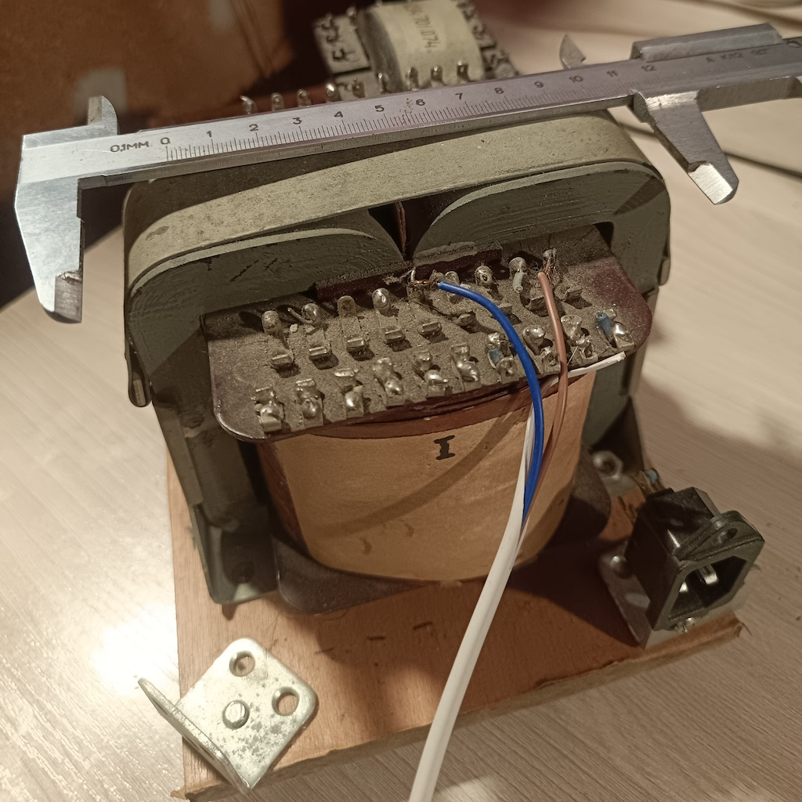

# Железо (Iron)

<div class="rom-hero">
    <h1 class="rom-hero-title">Трансформаторы и Дроссели</h1>
    <p class="rom-hero-subtitle">Сердце аналогового тракта</p>
</div>

---

## Выходные трансформаторы (ТВЗ)

### Прототип: ПЛ 16×36


| Параметр | Значение |
|----------|----------|
| **Сердечник** | ПЛ 16×36 (ленточный пермаллой) |
| **Намотка** | Ручная, 3П+2В (секционированная) |
| **Первичная обмотка** | 5000 витков, провод 0.25 мм |
| **Вторичная обмотка** | Под 4/8 Ом нагрузку |
| **Индуктивность** | ~80 Гн (на 100 Гц) |
| **Монтаж** | Сквозной, через шасси |

### Серия: ОСМ-0.063 (заводское исполнение)

| Параметр | Значение |
|----------|----------|
| **Сердечник** | ШЛ 20×25 (ОСМ-0.063) |
| **Сечение стали** | 5.0 см² (эффективное ~4.5 см²) |
| **Первичная обмотка (I)** | 3600 витков (провод 0.18–0.2 мм) |
| **Вторичная обмотка (II)** | 118 витков (на 8 Ом, провод 0.5 мм в 2 жилы) |
| **Секционирование** | 3П + 2В (П-В-П-В-П) |
| **Raa (приведенное)** | ~7.5 кОм |
| **Нижняя частота (fн)** | ~25 Гц (-1 дБ) |
| **Производство** | Заводская намотка, контроль качества |

---

## Силовой трансформатор (ТС)

### ОСМ-0.16 (заводское исполнение)



| Параметр | Значение |
|----------|----------|
| **Сердечник** | ШЛ 32×40 (ОСМ-0.16) |
| **Габаритная мощность** | 160 Вт (запас ×2 от потребления) |
| **Анодная обмотка** | 2 × 260В (0.25А) — под «двойное моно» |
| **Накальная обмотка 1** | 6.3В (4А) — выходные лампы + драйвер |
| **Обмотка смещения** | 50В (0.1А) — для «фикса» и ВАХ-метра |
| **Сервисная обмотка** | 12В (1А) — для Arduino Nano, реле и моторчика |
| **Производство** | Заводское изготовление |

---

## Дроссели фильтра

### ОСМ-0.036 (2 шт.)

| Параметр | Значение |
|----------|----------|
| **Магнитопровод** | ШЛ 16×25 (ОСМ-0.036) |
| **Сечение железа** | ~4.0 см² |
| **Индуктивность (L)** | 5.0 — 8.0 Гн (под нагрузкой) |
| **Максимальный ток (Imax)** | 0.2 А (200 мА) — с запасом для Г-807 |
| **Сопротивление (R)** | ~120–150 Ом |
| **Провод (медь)** | 0.22 — 0.25 мм (ПЭТВ-2) |
| **Количество витков** | 3500 (до заполнения окна) |
| **Немагнитный зазор** | 0.1 мм (один слой офисной бумаги) |
| **Производство** | Заводское изготовление |

---

## Намоточные данные (для самостоятельного изготовления)

### ТВЗ на ОСМ-0.063

```
Первичная обмотка:
  - Провод: ПЭТВ-2 0.18–0.2 мм
  - Витков: 3600
  - Секции: 3П+2В (П-В-П-В-П)
  - Сопротивление: ~150 Ом

Вторичная обмотка:
  - Провод: ПЭТВ-2 0.5 мм (в 2 жилы)
  - Витков: 118 (на 8 Ом)
  - Секции: 2 параллельно

Изоляция:
  - Межсекционная: лакоткань 0.1 мм
  - Межобмоточная: 3 слоя бумаги
  - Пропитка: парафин + воск
```

### ТС на ОСМ-0.16

```
Анодная обмотка:
  - Провод: ПЭТВ-2 0.25 мм
  - Витков: 2 × 1100 (260В)
  - Ток: 0.25А

Накальная обмотка:
  - Провод: ПЭТВ-2 0.8 мм
  - Витков: 24 (6.3В)
  - Ток: 4А

Обмотка смещения:
  - Провод: ПЭТВ-2 0.15 мм
  - Витков: 200 (50В)
  - Ток: 0.1А

Сервисная обмотка:
  - Провод: ПЭТВ-2 0.4 мм
  - Витков: 48 (12В)
  - Ток: 1А
```

### Дроссель на ОСМ-0.036

```
Обмотка:
  - Провод: ПЭТВ-2 0.22–0.25 мм
  - Витков: 3500
  - Зазор: 0.1 мм (офисная бумага)
  - Индуктивность: 5–8 Гн при 200 мА
```

---

## Материалы

### Сердечники

| Тип | Материал | Проницаемость |
|-----|----------|---------------|
| **ОСМ-0.036** | Сталь Э310 | μ ~ 2000 |
| **ОСМ-0.063** | Сталь Э310 | μ ~ 2000 |
| **ОСМ-0.16** | Сталь Э310 | μ ~ 2000 |

### Провода

- **ПЭТВ-2** — полиэфиримидная эмаль, класс нагревостойкости F (155°C)
- **Медь** — бескислородная, 99.99%

### Изоляция

- **Лакоткань** — 0.1 мм, класс F
- **Бумага** — конденсаторная, 0.02 мм
- **Пропитка** — парафин + пчелиный воск (1:1)

---

## Измерения

### Частотная характеристика ТВЗ (ОСМ-0.063)

```
25 Гц  : -1 дБ
100 Гц : 0 дБ (опорная)
1 кГц  : 0 дБ
10 кГц : -0.5 дБ
40 кГц : -1 дБ
```

### Фазовая характеристика

```
20 Гц  : +5°
1 кГц  : 0°
20 кГц : -3°
```

---

## Комплектация

<div class="rom-mission" style="margin-top: 1rem;">
    <p class="rom-mission-text">
        <strong>Заводские компоненты:</strong> трансформаторы (ТВЗ ОСМ-0.063, ТС ОСМ-0.16), дроссели (ОСМ-0.036), корпуса, распаянные платы.
    </p>
    <p class="rom-mission-text" style="margin-top: 1rem;">
        Для энтузиастов: публикуем спецификации для самостоятельного изготовления 
        трансформаторов и дросселей в домашних условиях.
    </p>
</div>

---

[← Назад к Малышу](index.md)
