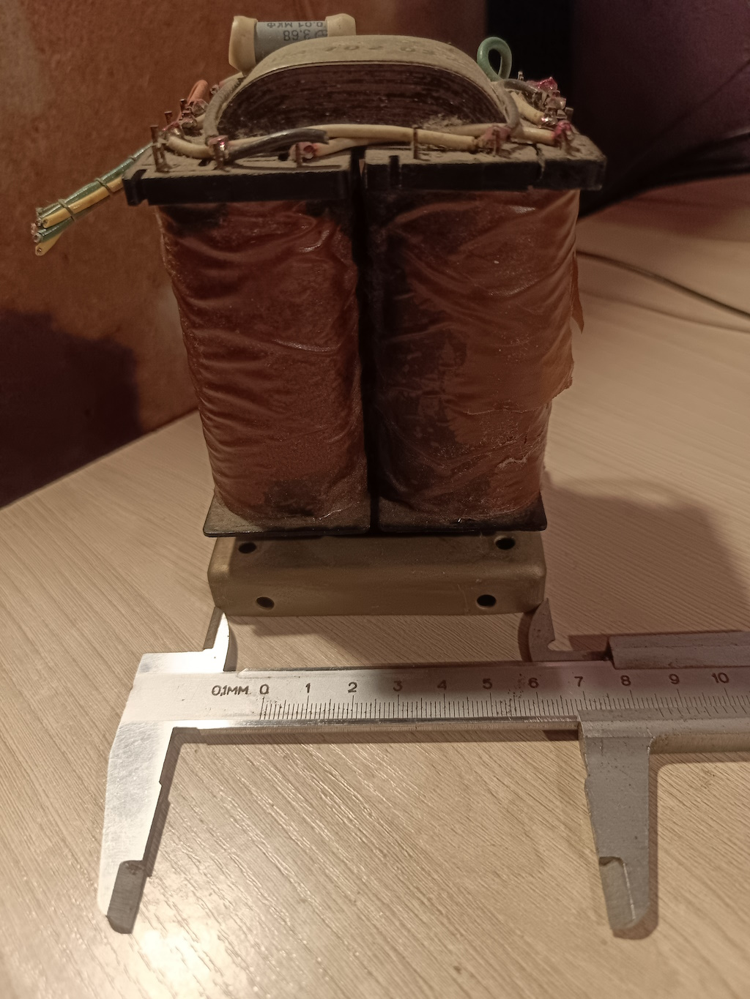

# 铁件 (Iron)

<div class="rom-hero">
    <h1 class="rom-hero-title">变压器和扼流圈</h1>
    <p class="rom-hero-subtitle">模拟路径的心脏</p>
</div>

---

## 输出变压器 (TVZ)

### 原型：PL 16×36



| 参数 | 值 |
|------|------|
| **铁芯** | PL 16×36 (带状坡莫合金) |
| **绕制** | 手工绕制，3P+2S (分段) |
| **初级** | 5000 匝，0.25 mm 线 |
| **次级** | 4/8 欧姆负载 |
| **电感** | ~80 H (100 Hz 时) |
| **安装** | 穿机箱 |

### 量产：OSM-0.063 (工厂制造)

| 参数 | 值 |
|------|------|
| **铁芯** | ШЛ 20×25 (OSM-0.063) |
| **钢截面积** | 5.0 cm² (有效 ~4.5 cm²) |
| **初级绕组 (I)** | 3600 匝 (线径 0.18–0.2 mm) |
| **次级绕组 (II)** | 118 匝 (8 欧姆，线径 0.5 mm 双股) |
| **分段** | 3P + 2S (P-S-P-S-P) |
| **Raa (反射阻抗)** | ~7.5 kOhm |
| **低频 (fL)** | ~25 Hz (-1 dB) |
| **生产** | 工厂绕制，质量控制 |

---

## 电源变压器 (TS)

### OSM-0.16 (工厂制造)


| 参数 | 值 |
|------|------|
| **铁芯** | ШЛ 32×40 (OSM-0.16) |
| **额定功率** | 160 W (×2 余量) |
| **阳极绕组** | 2 × 260V (0.25A) — 用于"双单声道" |
| **灯丝绕组 1** | 6.3V (4A) — 输出管 + 驱动 |
| **偏置绕组** | 50V (0.1A) — 用于固定偏置和特性曲线仪 |
| **服务绕组** | 12V (1A) — 用于 Arduino Nano、继电器和电机 |
| **生产** | 工厂制造 |

---

## 滤波扼流圈

### OSM-0.036 (2 件)

| 参数 | 值 |
|------|------|
| **磁芯** | ШЛ 16×25 (OSM-0.036) |
| **铁截面积** | ~4.0 cm² |
| **电感 (L)** | 5.0 — 8.0 H (负载下) |
| **最大电流 (Imax)** | 0.2 A (200 mA) — G-807 余量 |
| **电阻 (R)** | ~120–150 Ohm |
| **导线 (铜)** | 0.22 — 0.25 mm (PETV-2) |
| **匝数** | 3500 (填满窗口) |
| **非磁间隙** | 0.1 mm (一层办公纸) |
| **生产** | 工厂制造 |

---

## 绕制数据 (DIY 参考)

### TVZ on OSM-0.063

```
初级绕组:
  - 线：PETV-2 0.18–0.2 mm
  - 匝数：3600
  - 分段：3P+2S (P-S-P-S-P)
  - 电阻：~150 欧姆

次级绕组:
  - 线：PETV-2 0.5 mm (2 股)
  - 匝数：118 (8 欧姆)
  - 分段：2 并联

绝缘:
  - 段间：漆布 0.1 mm
  - 绕组间：3 层纸
  - 浸渍：石蜡 + 蜂蜡
```

### TS on OSM-0.16

```
阳极绕组:
  - 线：PETV-2 0.25 mm
  - 匝数：2 × 1100 (260V)
  - 电流：0.25A

灯丝绕组:
  - 线：PETV-2 0.8 mm
  - 匝数：24 (6.3V)
  - 电流：4A

偏置绕组:
  - 线：PETV-2 0.15 mm
  - 匝数：200 (50V)
  - 电流：0.1A

服务绕组:
  - 线：PETV-2 0.4 mm
  - 匝数：48 (12V)
  - 电流：1A
```

### 扼流圈 on OSM-0.036

```
绕组:
  - 线：PETV-2 0.22–0.25 mm
  - 匝数：3500
  - 间隙：0.1 mm (办公纸)
  - 电感：5–8 H (200 mA 时)
```

---

## 材料

### 铁芯

| 类型 | 材料 | 磁导率 |
|------|------|--------|
| **OSM-0.036** | 钢 E310 | μ ~ 2000 |
| **OSM-0.063** | 钢 E310 | μ ~ 2000 |
| **OSM-0.16** | 钢 E310 | μ ~ 2000 |

### 导线

- **PETV-2** — 聚酰亚胺漆，耐热等级 F (155°C)
- **铜** — 无氧，99.99%

### 绝缘

- **漆布** — 0.1 mm，F 级
- **纸** — 电容级，0.02 mm
- **浸渍** — 石蜡 + 蜂蜡 (1:1)

---

## 测量

### TVZ 频率响应 (OSM-0.063)

```
25 Hz  : -1 dB
100 Hz : 0 dB (参考)
1 kHz  : 0 dB
10 kHz : -0.5 dB
40 kHz : -1 dB
```

### 相位响应

```
20 Hz  : +5°
1 kHz  : 0°
20 kHz : -3°
```

---

## 套件内容

<div class="rom-mission" style="margin-top: 1rem;">
    <p class="rom-mission-text">
        <strong>工厂组件：</strong>变压器 (TVZ OSM-0.063, TS OSM-0.16)、扼流圈 (OSM-0.036)、外壳、预焊接电路板。
    </p>
    <p class="rom-mission-text" style="margin-top: 1rem;">
        面向爱好者：我们发布规格供爱好者在家自制变压器和扼流圈。
    </p>
</div>

---

[← 返回 Малыш](index.md)
